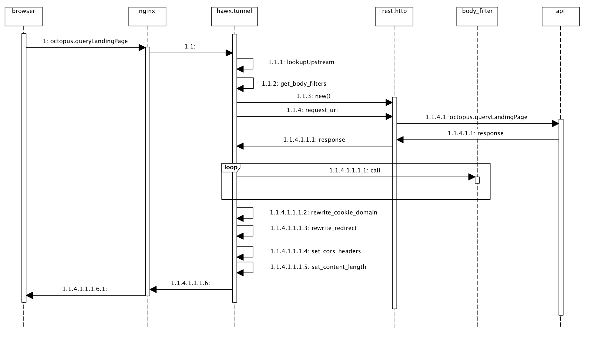
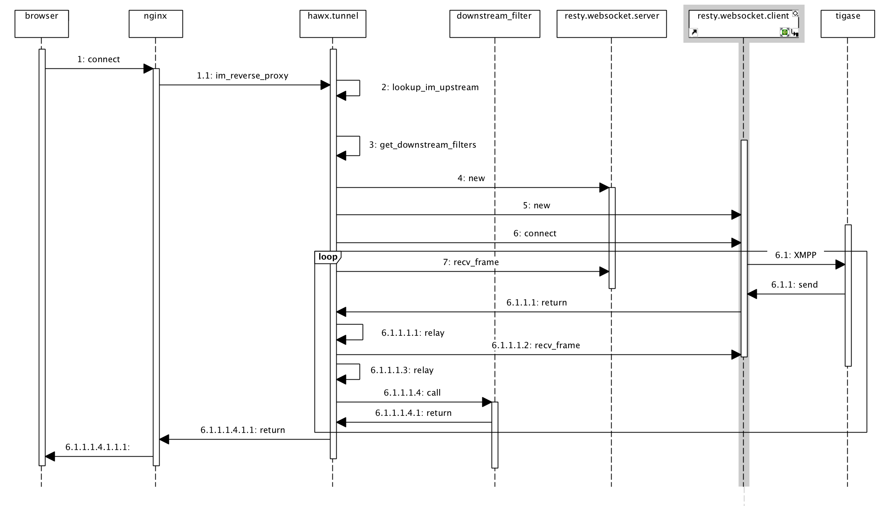

# HTTP及websocket高级反向代理

## 简介

本项目基于nginx+lua提供一种通用的将内部web应用共享到外网的功能。减少部署相同的应用部署两套环境的麻烦。特定应用中的响应内容即使有加密、压缩、内容混淆，通过定义定制的内容重写过滤器就可以予以支持。比如，某应用的响应数据对H5链接做了base64编码。针对这种情况，我们可以定义专的内容过滤器，解开base64编码，然后再做内容重写。

重写的基本规则如下：

- 对于外网域名及子域名下任何HTTP请求将其代理到对应的内网域名
- 请求中包含的Cookie, 及其它header中包含有外网域名的也要重写内网域名
- 对于HTTP响应中的js/html/css中包含内网域名及其子域名的地址要重写为外网域名
- 对于HTTP响应中的Cookie及其它header中包含有内网域名的要重写为外网域名

本方案主要基于nginx(tengine)的ngx\_http\_lua\_module模块提供的lua脚本。
通过配置content phase 的content\_by\_lua指令，指定双向重写的规则。

### hawx.tunnel模块

重写规则是封装在名为hawx.tunnel的模块中。该模块的主要方法如下：

| 序号 | 方法名称            | 参数            |  使用说明             |
| --- | ------------------ | -------------- | -------------        |
| 01  | new                | options对象     | 构建tunnel对象        |
| 02  | http_reverse_proxy | 无              | 触发HTTP反向代理      |
| 03  | im_reverse_proxy   | 无              | 触发websocket反向代理 |
| 04  | default_body_filter| data, from, to | 替换data中from文本为to |

#### new()

new()方法是构造函数，它支持传递options对象，该对象可以指定以下属性：

| 序号 | 参数                 |  使用说明                                 |
| --- | -------------------- | --------------------------------------- |
| 01  | upstream             | 反向代理的后端名称, 对于HTTP请求可选         |
| 02  | protocol             | 协议, 目前仅支持wss和ws, 默认为wss          |
| 03  | context_path         | context path, 可选                       |
| 04  | inner_domain         | 内网域名                                 |
| 05  | outer_domain         | 外网域名                                 |
| 06  | content_type         | 强制设置Content-Type为固定值              |
| 07  | with_cors_header     | 设置跨域HTTP头                           |
| 08  | default_cors_origin  | 默认的置跨域Origin头                      |
| 09  | body_filters         | 响应内容重写链, 默认使用内网域名替换为外网域名 |

body_filters是一组lua函数。它们接收以下参数:

- body
- inner_domain
- outer_domain

其功能是重写body中出现的特定模式的文本为替换文本。

#### http_reverse_proxy()

该方法是触发HTTP反向代理的功能。其内部实现如下图所示:

典型的用法如下：

    local tunnel  = require "hawx.tunnel"
    local rewrite = require "xxxx.rewrite"
    tunnel:new {
       upstream            = "api-gateway",
       context_path        = "/api",
       inner_domain        = "inner.com",
       outer_domain        = "outer.com",
       with_cors_header    = true,
       default_cors_origin = "http://www.test.outer.com",
       body_filters        = {
           rewrite.api_resp_rewrite_filter
       }
    }:http_reverse_proxy()

#### im_reverse_proxy()

该方法是触发websocket反向代理的功能。其内部实现如下图所示:

典型的用法如下：

    local tunnel = require "hawx.tunnel"
    tunnel:new {
        upstream     = "tigase",
        protocol     = "ws",
        inner_domain = "inner.com",
        outer_domain = "outer.com"
    }:im_reverse_proxy()

#### default_body_filter()

如果不指定body_filters, 那么该函数会自动生效。如果指定了body_filters，但还需要该函数生效，
那么必须body_filters列表中明确指定该函数。示例如下：

    local tunnel  = require "hawx.tunnel"
    local rewrite = require "xxxx.rewrite"
    tunnel:new {
        upstream            = "message",
        inner_domain        = "inner.com",
        outer_domain        = "outer.com",
        with_cors_header    = true,
        default_cors_origin = "http://www.test.outer.com",
        body_filters = {
            tunnel.default_body_filter,
            rewrite.https_downgrade_rewrite_filter
        }
    }:http_reverse_proxy()

#### https_downgrade_rewrite_filter()

重写HTTP响应中的内网地址,使其降级为HTTP。这个fitler是用于开发测试，正式环境不要使用。

## 配置要求

### 第三方模块

本方案在现有的tengine服务器配置上需要以下新增模块:

- cjson
- resty.http
- resty.websocket
- ngx_http_lua_upstream_module

#### cjson

[cjson][1]是lua的中用C实现的JSON模块。它是一个动态链接库(cjson.so)。
由于默认情况下该模块会对斜杠进行转义，导致http链接错误。所以，需要使用
[打过patch的版本][5]。该patch已经提交pull request，进展可以关注这个[pull
request][6]

resty.http则是lua的http模块，它用来实现反向代理请求后端服务。

#### ngx_http_lua_upstream_module

ngx_http_lua_upstream_module则是Tengin/nginx的扩展模块，需要编译成动态链接库
或者静态编译到Tengine中。为了兼容Tengine/2.1.2 (nginx/1.6.2)本方案使用该模块的v 0.04版本。
[下载链接][2]。该模块用来读取nginx中的upstream定义。

#### resty.http

本模块是纯lua模块，它用于实现HTTP反向代理功能。它是向后端服务发起请求的非阻塞HTTP类库。

#### resty.websocket

本模块是纯lua模块，它用于实现websocket反向代理功能。目前，这个类库需要打补丁才能使用。
[该补丁][3]是本项目的一部分。它允许发起websocket链接时指定cookie。

### Tengine配置

tengine需要设置lua的模块和二进制模块搜索路径。建议配置如下：

    lua_package_path "/usr/local/tengine/conf/lua_ngx/?.lua;;";
    lua_package_cpath '/usr/local/tengine/conf/lua_ngx/?.so;;';

实施简单内容重写的配置如下：

    server {
        listen               80;
        server_name          www.test.outer.com;

        location / {
            client_max_body_size 500k;
            client_body_buffer_size 500k;

            content_by_lua_block {
                local tunnel  = require "hawx.tunnel"
                local rewrite = require "xxxx.rewrite"
                tunnel:new {
                    upstream     = "innerlb",
                    inner_domain = "inner.com",
                    outer_domain = "outer.com",
                    body_filters = {
                        tunnel.default_body_filter,
                        rewrite.tfs_link_rewrite_filter,
                        rewrite.im_rewrite_filter
                    }
                }:http_reverse_proxy()
            }
        }
    }

实施API请求内容重写的配置如下：

    server {
        listen               80;
        server_name          api.test.outer.com;

        location / {
            rewrite ^/(.*)$ /api/$1 last;
        }

        location ~* ^/api/.*$ {
            client_max_body_size 500k;
            client_body_buffer_size 500k;

            content_by_lua_block {
                local tunnel  = require "hawx.tunnel"
                local rewrite = require "xxxx.rewrite"
                tunnel:new {
                    upstream            = "api-gateway",
                    context_path        = "/api",
                    inner_domain        = "inner.com",
                    outer_domain        = "outer.com",
                    with_cors_header    = true,
                    default_cors_origin = "http://www.test.outer.com",
                    body_filters        = {
                        rewrite.api_resp_rewrite_dev_filter,
                        rewrite.https_downgrade_rewrite_filter
                    }
                }:http_reverse_proxy()
            }
        }
    }

实施IM请求内容重写的配置如下：

    server {
        listen               80;
        server_name          im.test.outer.com;

        location / {
            lua_socket_log_errors off;
            content_by_lua_block {
                local tunnel = require "hawx.tunnel"
                tunnel:new {
                    upstream     = "tigase",
                    protocol     = "ws",
                    inner_domain = "inner.com",
                    outer_domain = "outer.com"
                }:im_reverse_proxy()
            }
        }
    }

### 启动环境

启动环境前需要切换到项目目录下。如果尚未创建项目的工作区，请按以下命令创建:

    git clone https://github.com/schnell18/hawks.git

启动环境只需运行以下命令：

    cd venv
    docker-compose up

[1]: https://www.kyne.com.au/~mark/software/lua-cjson-manual.html
[2]: https://github.com/openresty/lua-upstream-nginx-module/tree/v0.04
[3]: https://github.com/schnell18/lua-resty-websocket.git
[4]: https://www.docker.com/
[5]: https://github.com/schnell18/lua-cjson
[6]: https://github.com/mpx/lua-cjson/pull/57
